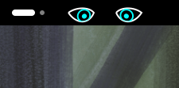
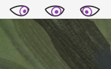
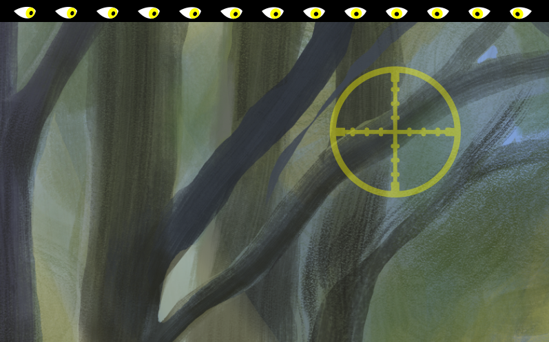
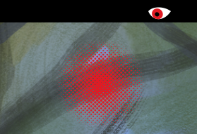

<h1 align="center">Eye on Cursor</h1>

    
    
    
    

  

<h3 align="center">Let your desktop "keep an eye" on your mouse!</h3>

## Overview

**Eye on Cursor** is a fun and practical extension that gives your panel eyes that constantly follow your mouse. This quirky feature, combined with a highly customizable mouse tracker that highlights clicks, makes it easier than ever to monitor your mouse movements, ensuring your pointer gets all the attention it needs.

  

 

## Features

- **Eyes Follow Cursor:** As many eyes as you want in the panel to follow the cursor movements, providing a fun and interactive experience.
- **Customizable Mouse Tracker:** Highlights clicks and tracks mouse movements with customizable settings to fit your preferences.
- **Click Highlighting:** Visual feedback for mouse clicks, making it easier to keep track of your actions, especially useful for presentations or demonstrations.

## Installation

### From the GNOME Extensions Website (recommended)

*Note: The extension is not yet available on the GNOME Extensions website.*

### Manually

1. Clone or download and unzip the repository.
2. At the root of the repository, run `make install`. The command will pack the extension and place it in `~/.local/share/gnome-shell/extensions`.
3. Log out, log back in, then enable the extension in your extensions app.

## Acknowledgements

This extension is forked from [Eye and Mouse Extended](https://extensions.gnome.org/extension/3139/eye-extended/) by [Alexey Lovchikov](https://github.com/alexeylovchikov).

**Eye and Mouse Extended** also has a fork for the Cinnamon Desktop, [c-eyes](https://github.com/anaximeno/c-eyes), created by [anaximeno](https://github.com/anaximeno/).

## Contributing

Contributions are welcome! Please feel free to submit a pull request or open an issue if you have any suggestions or find any bugs.

Translations and new glyphs for the mouse tracker are greatly appreciated as well!

If you have contributed in any way, feel free to add yourself to the `credits.js` file in `settings`.

### Development

Here are a few steps to get you set up:

1. Create a fork to start working on the changes you want to implement.
2. Clone your repository.
3. In the root of the repo, run `npm install` to enable linting and formatting (you need the `nodejs` package installed on your system). You will then be able to run `npm run lint` and `npm run format` to check the code.
4. Run `make install && make enable` to use the extension or `make test` to debug it. The `Makefile` contains a few other commands that should be useful for debugging.

### Documentation on Developing GNOME Extensions

Resources to get you started:

- [GJS Guide](https://gjs.guide/)
- [GNOME Shell Extensions Review Guidelines](https://gjs.guide/extensions/review-guidelines/review-guidelines.html)
- [GNOME Human Interface Guidelines](https://developer.gnome.org/hig/)

### Known Issues

- On Wayland, mouse tracker click highlighting does not work on windows.
- On x11, middle click is not registered.
